## Introduction
The **Azure CAF rover** is a Docker container in charge of the deployment of the landing zones in your Azure environment. It is acting as a **sandbox toolchain** development environment to avoid impacting the local machine but more importantly to make sure that all contributors in the GitOps teams are using a **consistent set of tools** and version. 

The Azure CAF rover is the same container regarless you are using Windows, Linux or macOS. On the local GitOps machine you need to install Visual Studio Code. The Azure CAF rover is executed locally in a container.


You can learn more about the Visual Studio Code Remote on this [link](https://code.visualstudio.com/docs/remote/remote-overview).


## Pre-requisites
The Visual Studio Code system requirements describe the steps to follow to get your GitOps development environment ready -> [link](https://code.visualstudio.com/docs/remote/containers#_system-requirements)
* **Windows**: Docker Desktop 2.0+ on Windows 10 Pro/Enterprise in Linux Container mode
* **macOS**: Docker Desktop 2.0+
* **Linux**: Docker CE/EE 18.06+ and Docker Compose 1.24+

The Azure CAF rover is a Centos:7 base image and is hosted on the Docker Hub.
https://hub.docker.com/r/aztfmod/rover/tags?page=1&ordering=last_updated

Install
* Visual Studio Code version 1.41+ - [link](https://code.visualstudio.com/Download)
* Install Visual Studio Code Extension - Remote Development - [link](https://marketplace.visualstudio.com/items?itemName=ms-vscode-remote.vscode-remote-extensionpack)

## To create a GitHub respository based on the rover template and start from scratch a new landing zone

Go to the Azure CAF rover remote container template https://github.com/aztfmod/rover-remote-container

You install the Azure CAF rover by adding the following folder and files:

**Click on the templace button:**

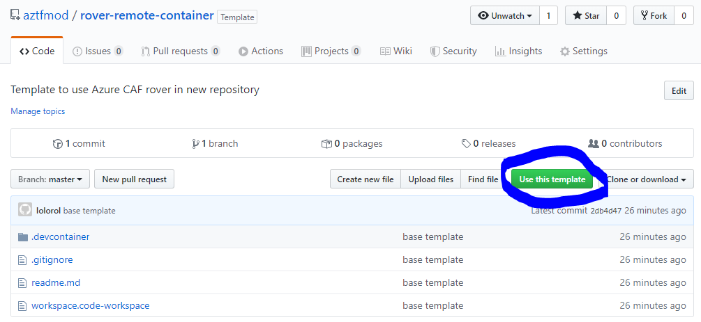

**Set a name to the repository**

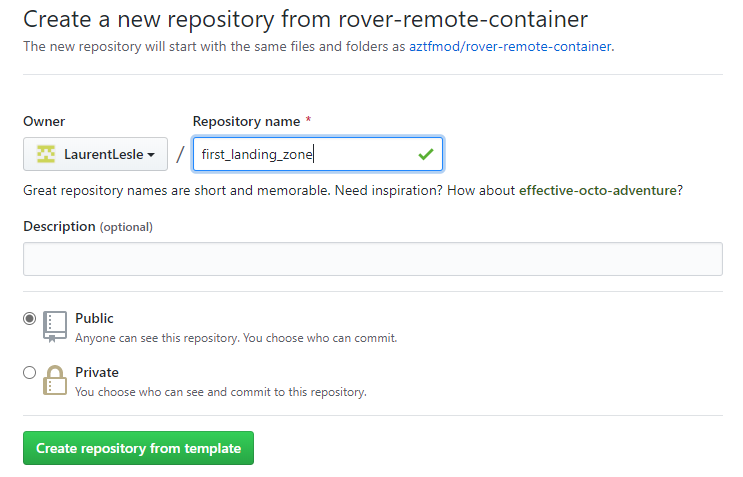

**Wait for the repository to be created**

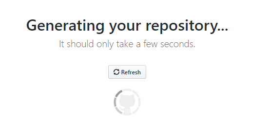

**Clone the repository using SSH - copy the url**

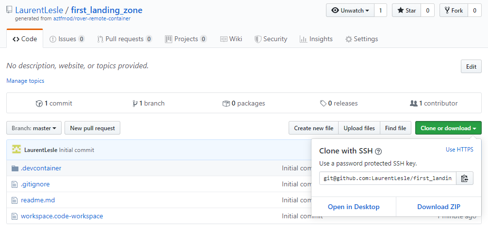

**From a console execute the git clone command**


**Open the cloned repository with Visual Studio Code**


**Visual Studio Code opens**

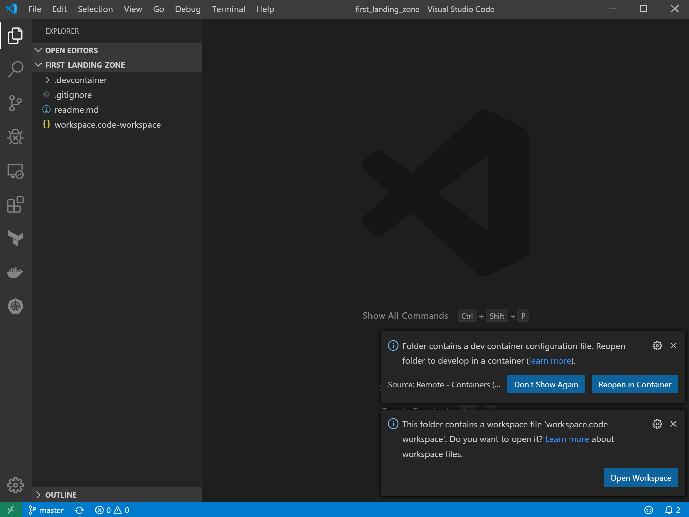

| Note: the bottom left green button shows the Visual Studio Remote Development extension has been installed

**Click on the button "Reopen in Container"**

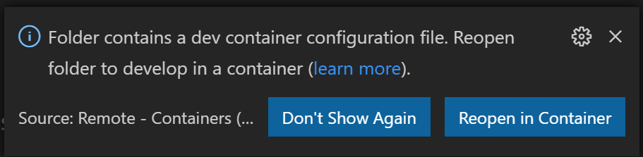

While Visual Studio Code reopens your project and load the Azure CAF rover you will see the following icon

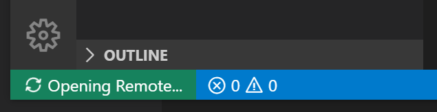

| Note: The first time it will take longer as the full docker image has to be downloaded.

When successfuly loaded you will see Visual Studio Code opened with the following look and feel

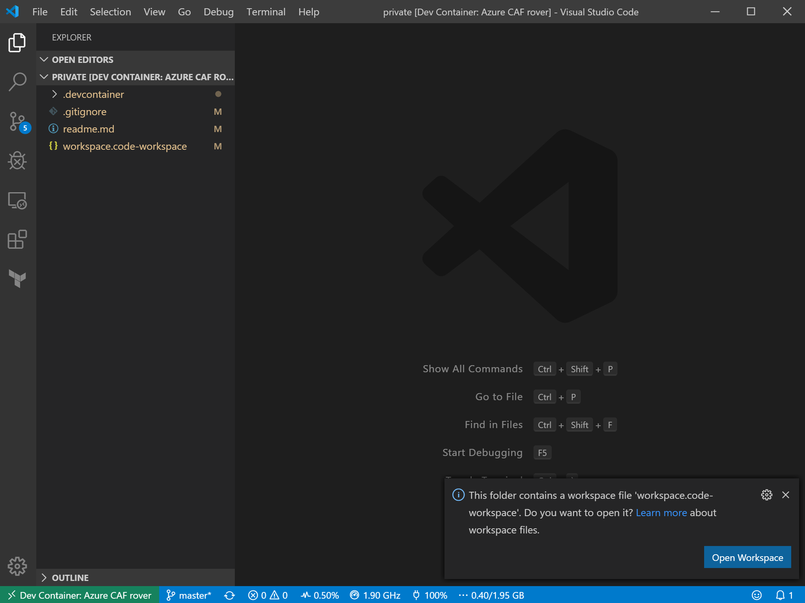

It is recommeded you leverage the workspace in order to drive more consistancy across different operating systems

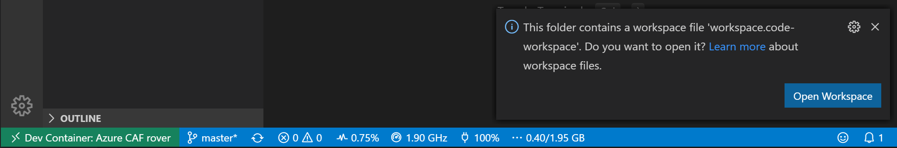

## Login the rover to Azure
Open a new terminal from the menu Terminal..New Terminal

Run **Rover login**

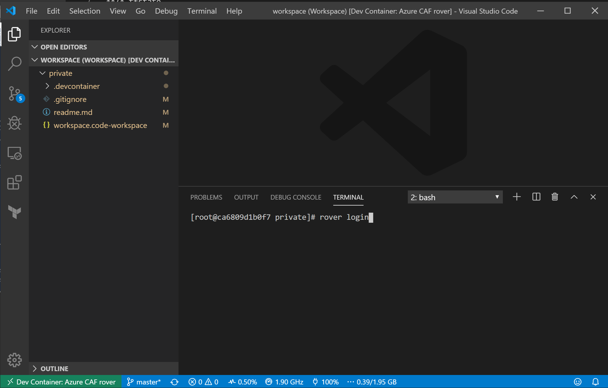

Note: If you have more than one subscription or Azure AD Tenant you can use the command: 
```bash
# Login to your Azure subscription --> if you have multiple subscriptions and tenant, set the subscription guid and tenant guid
rover login [subscription_guid] [tenantname.onmicrosoft.com or tenant_guid]
# Verify the current Azure subscription
az account show
```

**Authenticate with your credential**

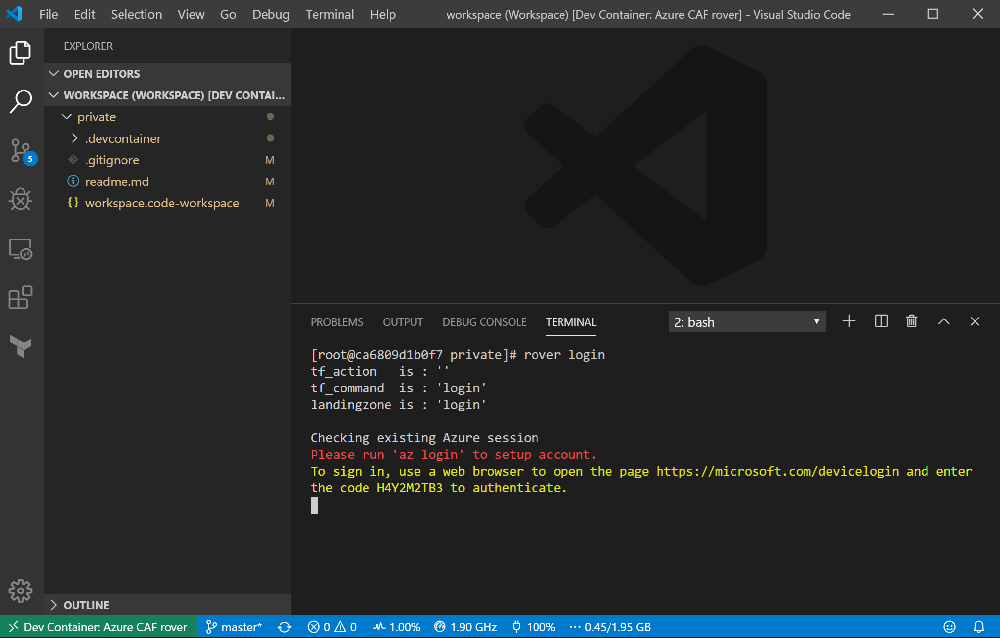

Note: Copy the code and open the device login to set your username and password


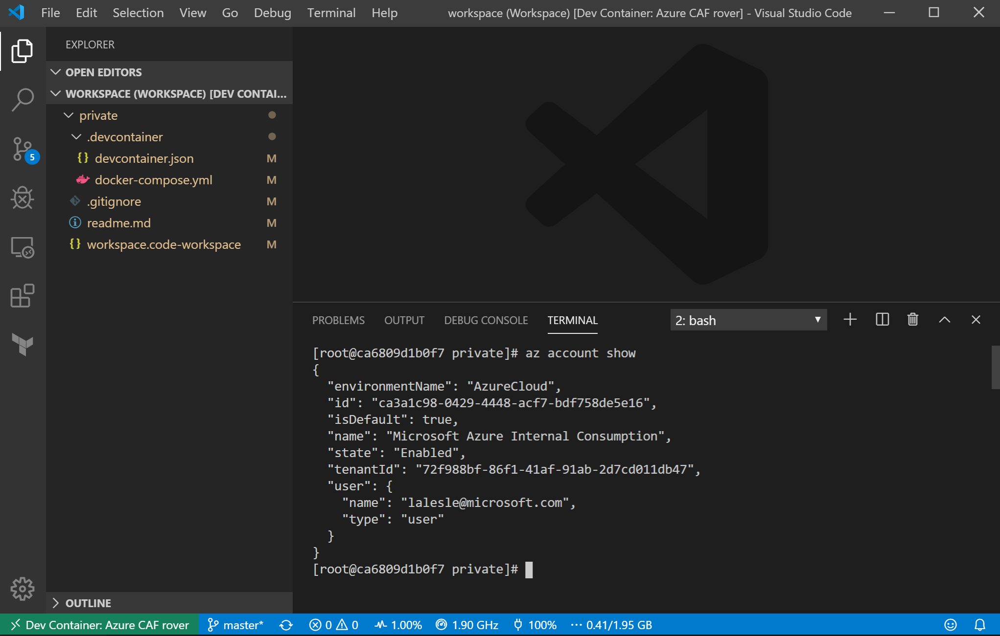

## Initialize the Level0 launchpad

Initialize the rover by calling the rover command. The initialization of the launchpad will take between 5-10 mins.

```bash
# Deploy the launchpad level0
rover
```

## Deploy the Cloud Adoption Framework foundations landing zone: 
```bash
# Display the resources that are going to be deployed
rover /tf/landingzones/landingzone_caf_foundations plan

# Deploy the resources
rover /tf/landingzones/landingzone_caf_foundations apply

```


### Something you want, something not working?
Open an issue list to report any issues and missing features.


## Troubleshooting
### Error codes
Error code returned by the bash (echo $?)

| Code | Description | 
|--- |--- |
| 0 | Operation completed successfully 
|2 | Not connected to Azure subscription. You need to logout / login and set the default subscription 
|10 | Launchpad is installed but no landingzone and action arguments have been set 
|11 | Landingzone argument set without an action 
|12 | Landingzone folder does not exist in the rover 

### Purging Docker cache
You can purge Docker cache running the following command:
```bash
docker system prune -a
```

### Clean up the Dev Container volumes

```bash
# To list all Dev Container volumes
docker volume ls -f label=caf

# To cleanup de Dev Container volumes make sure there is not running or stopped containers
docker ps
docker ps -a

# To cleanup all Dev Containers and volumes
docker rm -f $(docker ps -a -q -f label=caf)
docker volume prune -f --filter label=caf

# To cleanup a specific Dev Container
docker volume rm -f $(docker volume ls -f label=com.docker.compose.project=landingzones_devcontainer)
```

### Limitations

* You cannot run the rover from the Azure Cloud Shell (including the Windows Terminal Azure Cloud Shell) at the moment.

